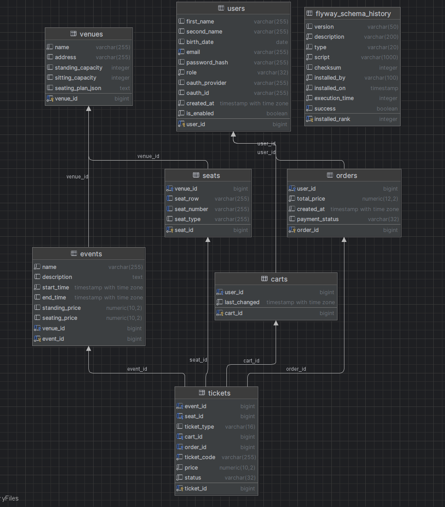
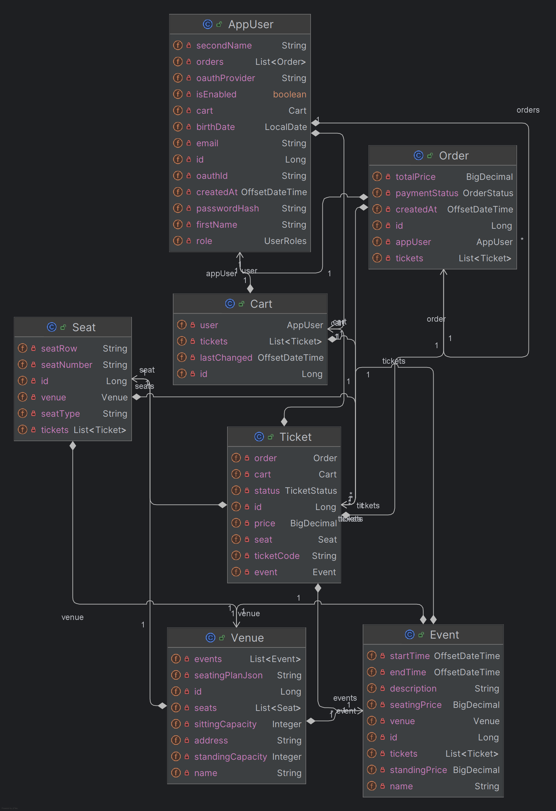
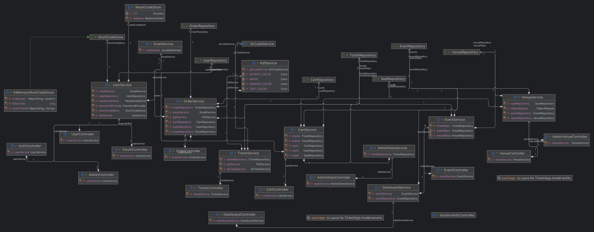
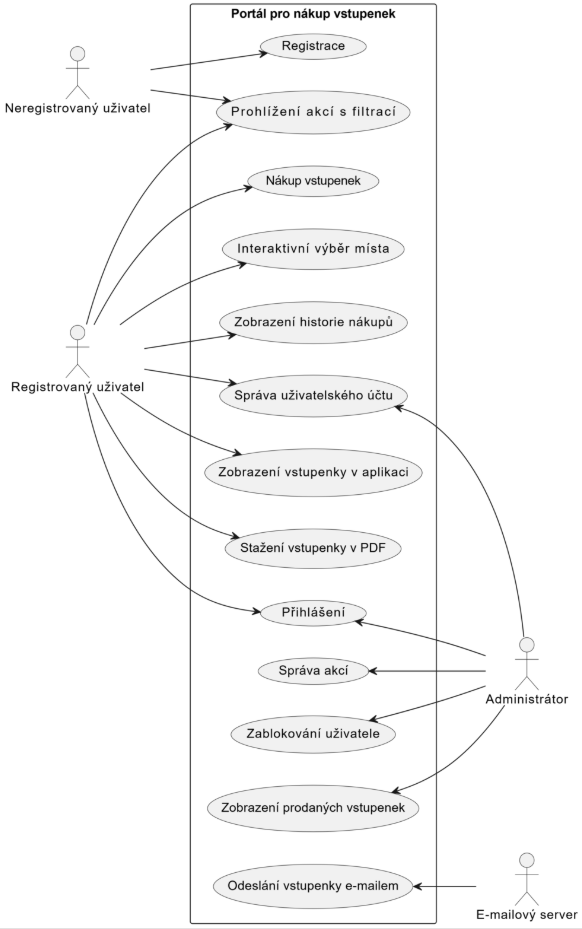
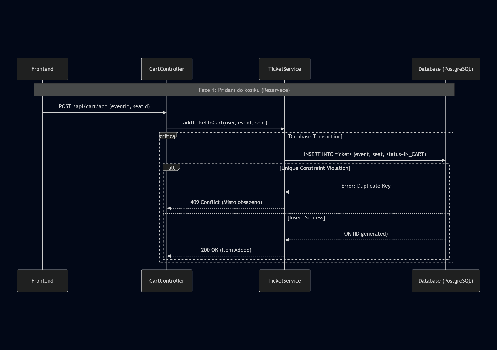
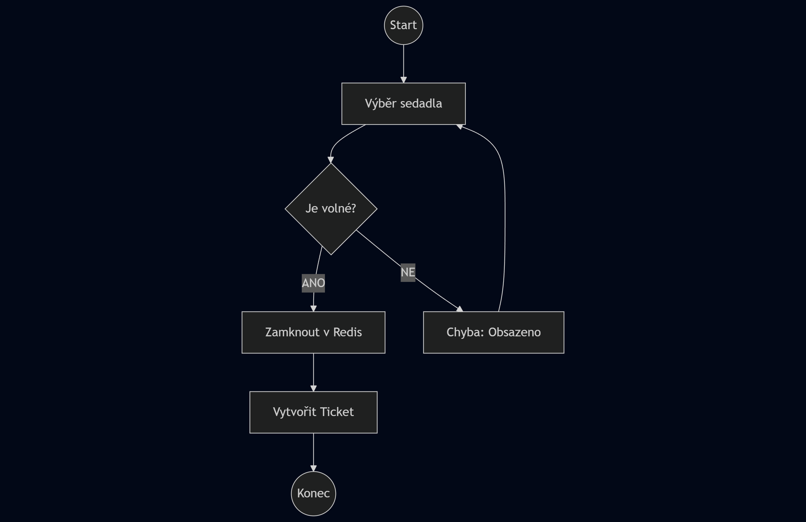
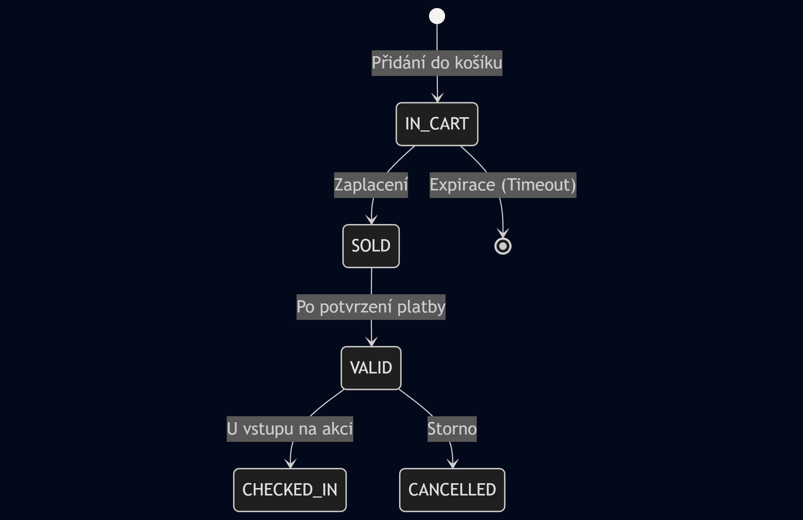
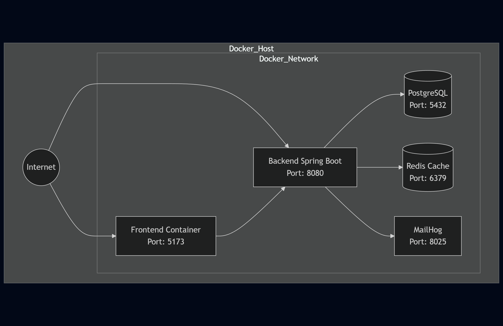

# Technická dokumentace - Backend Aplikace pro Prodej Vstupenek

Tento dokument detailně popisuje serverovou část aplikace pro prodej a rezervaci vstupenek. Systém je navržen jako RESTful služba postavená na ekosystému Java a Spring Boot, s důrazem na bezpečné zpracování transakcí a škálovatelnost pomocí kontejnerizace.
## Obsah
1. [Úvod a Technologie](#1-úvod-a-technologie)
2. [Architektura a Struktura Kódu](#2-architektura-a-struktura-kódu)
3. [Datová Vrstva a Migrace](#3-datová-vrstva-a-migrace)
4. [Zabezpečení (Security)](#4-zabezpečení-security)
5. [REST API a Kontrolery](#5-rest-api-a-kontrolery)
6. [Klíčové Funkcionality](#6-klíčové-funkcionality)
7. [Testování a Kvalita Kódu](#7-testování-a-kvalita-kódu)
8. [Instalace, Docker a Spuštění](#8-instalace-docker-a-spuštění)
9. [Strukturální pohled](#9-strukturální-pohled)
10. [Behaviorální pohled](#10-behaviorální-pohled)
11. [Infrastruktura a Nasazení](#11-infrastruktura-a-nasazení)
---

## 1. Úvod a Technologie

### 1.1 Přehled Projektu
Backendová logika je implementována v jazyce Java 21. Jako aplikační rámec byl zvolen Spring Boot 3.5.6, který zajišťuje správu závislostí, konfiguraci webového serveru a bezpečnostní vrstvy.
### 1.2 Technologický Stack
**Core & Frameworks**
- **Java 21** - Programovací jazyk
- **Spring Boot 3.5.6** - Aplikační framework (Web, Data JPA, Security, Validation, Mail)
- **Gradle** - Build tool a dependency management
- **Lombok** - Redukce boilerplate kódu

**Data & Storage**
- **PostgreSQL** - Relační databáze (obraz `postgres:latest`)
- **Redis 7** - In-memory databáze pro distribuované zámky a caching
- **Spring Data JPA (Hibernate)** - ORM vrstva
- **Flyway** - Verzování databázového schématu
- **Redisson** - Redis klient pro Javu (správa distribuovaných zámků)

**Security**
- **Spring Security** - Autentizace a autorizace
- **JWT (jjwt)** - Stateless autentizace pomocí JSON Web Tokenů
- **OAuth2 Client** - Podpora přihlášení přes externí poskytovatele (Google)

**Dokumenty a Média**
- **ZXing** - Generování QR kódů pro vstupenky
- **OpenPDF** - Generování PDF dokumentů

**Dokumentace**
- **SpringDoc OpenAPI (Swagger UI)** - Automatická dokumentace API

---

## 2. Architektura a Struktura Kódu

### 2.1 Architektonický Vzor
Aplikace striktně dodržuje principy vrstvené architektury (Layered Architecture), což usnadňuje testování a budoucí rozšiřování kódu.
```text
┌───────────────────────────────┐
│       Controller Layer        │ REST Endpointy, validace vstupu (DTO)
├───────────────────────────────┤
│        Service Layer          │ Byznys logika, transakce, generování PDF
├───────────────────────────────┤
│       Repository Layer        │ JPA Interfaces, DB queries
├───────────────────────────────┤
│       Database Layer          │ PostgreSQL + Redis (Cache/Locks)
└───────────────────────────────┘
```

**Klíčové Principy:**
- **Dependency Injection (DI):** Využití Spring IoC kontejneru pro správu závislostí. Komponenty jsou anotovány jako `@Service`, `@RestController` a jsou propojovány pomocí konstruktoru (`@RequiredArgsConstructor` z Lomboku).
- **DTO Pattern (Data Transfer Object):** Striktní oddělení interních databázových entit od veřejného API. Pro komunikaci s klientem se využívají DTO objekty (např. `EventDetailDto`, `CartItemDto`, `TicketDto`), což umožňuje měnit vnitřní strukturu bez dopadu na API.
- **Global Exception Handling:** Centralizované zpracování chyb pomocí `@ControllerAdvice` ve třídě `GlobalExceptionHandler`. To zajišťuje, že API vrací konzistentní chybové odpovědi (JSON s popisem chyby a HTTP stavovým kódem) i v případě neočekávaných výjimek.

### 2.2 Struktura Adresářů
Zdrojový kód backendu je organizován v balíčku `cz.upce.fei.TicketApp`. Struktura je členěna logicky podle vrstev a doménových oblastí:

```text
src/main/java/cz/upce/fei/TicketApp/
├── TicketAppApplication.java       # Vstupní bod aplikace
├── configuration/                  # Globální konfigurace (OpenAPI, CORS)
├── controller/                     # REST API (vstupní body pro Admin, Auth, Event...)
├── dto/                            # Datové přenosové objekty
│   ├── admin/
│   ├── auth/                       # LoginDto, RegisterDto
│   ├── cart/                       # CartDto, CartItemDto
│   ├── event/                      # EventCreateDto, EventDetailDto
│   ├── order/
│   ├── ticket/
│   └── ...
├── exception/                      # Vlastní výjimky a GlobalExceptionHandler
├── model/
│   ├── entity/                     # JPA Entity (AppUser, Event, Ticket, Seat...)
│   └── enums/                      # Enumy (UserRoles, TicketType, OrderStatus...)
├── repository/                     # Spring Data Repositories (přístup k datům)
├── security/                       # Bezpečnostní konfigurace
│   ├── JwtAuthFilter.java          # Filtr pro validaci JWT
│   ├── OAuth2LoginSuccessHandler.java
│   └── SecurityConfig.java         # Hlavní konfigurace bezpečnosti
├── service/                        # Byznys logika aplikace
│   ├── oauth2/                     # Logika pro OAuth2 short-codes
│   ├── passwordReset/              # Logika resetu hesla (EmailService)
│   ├── CartService.java
│   ├── EventService.java
│   ├── OrderService.java
│   ├── PdfService.java             # Generování PDF vstupenek
│   ├── QrCodeService.java          # Generování QR kódů
│   ├── TicketService.java
│   └── ...
└── util/                           # Pomocné třídy (PasswordConfig)
```

---
## 3. Datová Vrstva a Migrace

### 3.1 Datové Modely (Entity)
Návrh databáze odráží potřeby rezervačního systému, kde je nutné evidovat nejen akce, ale i fyzické rozložení sálů.
#### Uživatelé (`AppUser`)
- **Tabulka `users`:** Ukládá identifikační údaje uživatelů.
- **Atributy:** Email (unikátní identifikátor), hash hesla, role (`UserRoles`), OAuth provider (pokud je přihlášen přes třetí stranu).
- **Vazby:** Uživatel má vazbu 1:1 na `Cart` (košík) a 1:N na `Order` (objednávky).

#### Akce a Místa (`Event`, `Venue`)
- **Venue (`venues`):** Reprezentuje místo konání kulturní akce.
    - Obsahuje JSON atribut `seating_plan_json`, který definuje vizuální rozložení sedadel.
    - Definuje kapacity pro stání a sezení.
- **Event (`events`):** Konkrétní událost vázaná na `Venue`.
    - Uchovává čas konání (`start_time`, `end_time`) a ceny pro různé typy vstupenek.

#### Obchodní Logika (`Ticket`, `Order`, `Cart`)
- **Seat (`seats`):** Konkrétní sedadlo v sále (řada, číslo). Unikátnost v rámci sálu je vynucena kompozitním indexem.
- **Ticket (`tickets`):** Klíčová entita systému.
    - Každá vstupenka má unikátní `ticket_code`.
    - Stav vstupenky je řízen enumem `TicketStatus` (`VALID`, `IN_CART`, `SOLD`).
    - Může být vázána na konkrétní sedadlo (`Seat`) nebo být pouze na stání.
- **Cart (`carts`):** Nákupní košík uživatele. Slouží k dočasné rezervaci vstupenek před jejich zakoupením.
- **Order (`orders`):** Dokončená objednávka, která vznikne po zaplacení obsahu košíku.

### 3.2 Databázové Migrace (Flyway)
Správa databázového schématu je plně automatizovaná nástrojem **Flyway**. Migrační skripty (SQL) jsou umístěny v `src/main/resources/db/migration/`.

- **V1__scheme.sql:** Vytvoření základních tabulek (`users`, `venues`, `seats`, `events`, `orders`, `tickets`) a indexů.
- **V2__seed_dev.sql:** Naplnění databáze testovacími daty (uživatelé, venues) pro vývojové prostředí.
- **V3__seed_more_events.sql:** Přidání dalších testovacích akcí.
- **V4__add_enabled_status_to_users.sql:** Rozšíření tabulky uživatelů o sloupec is_enabled pro správu stavu účtu (aktivní/blokovaný).
- **V5__atomicity_solution.sql:** Úpravy schématu pro zajištění atomicity transakcí, což je kritické pro prevenci chyb při souběžném nákupu.

---

## 4. Zabezpečení (Security)

Zabezpečení zajišťuje `SecurityConfig` a vlastní filtry. Aplikace využívá **bezstavovou (Stateless)** architekturu, kde server neudržuje session uživatele v paměti (s výjimkou dočasných OAuth stavů).

### 4.1 Autentizační Flow
1. **Login:** Klient odešle přihlašovací údaje (email/heslo) na `/api/auth/login`.
2. **Ověření:** `AuthService` ověří hash hesla.
3. **Token:** Po úspěšném ověření server vydá **JWT Access Token**.
4. **Request:** Klient posílá token v hlavičce `Authorization: Bearer <token>` u každého chráněného požadavku.
5. **Validace:** Filtr `JwtAuthFilter` zachytí požadavek, ověří platnost podpisu tokenu a nastaví kontext bezpečnosti (`SecurityContextHolder`).

### 4.2 OAuth2 Integrace
Aplikace podporuje přihlášení přes externí poskytovatele (Google, GitHub).
- **Handler:** Třída `OAuth2LoginSuccessHandler` zpracuje úspěšné přesměrování od poskytovatele.
- **Short-Code:** Pro bezpečné předání JWT tokenu na frontend (běžící na jiné doméně/portu) se využívá mechanismus "short-code", kdy je token dočasně uložen a frontend si jej vyzvedne jednorázovým kódem.

### 4.3 Role a Ochrana Endpointů
Konfigurace v `SecurityConfig` definuje pravidla přístupu na základě URL a rolí (`UserRoles`):

- **Veřejné (PermitAll):**
    - `/api/events/**` (prohlížení akcí)
    - `/api/auth/**` (registrace, login, reset hesla)
    - `/swagger-ui/**`, `/v3/api-docs/**` (dokumentace API)
- **Přihlášení uživatelé (Authenticated):**
    - Veškeré ostatní endpointy vyžadují platný JWT token.
- **Administrátoři (HasRole 'ADMINISTRATOR'):**
    - Cesty `/api/admin/**` jsou vyhrazeny pouze pro uživatele s rolí `ADMINISTRATOR`.

### 4.4 CORS Konfigurace
Pro umožnění vývoje, kde frontend běží odděleně (např. na portu 5173), je povoleno **Cross-Origin Resource Sharing (CORS)**.
- **Povolené Origins:** `http://localhost:5173`
- **Povolené Metody:** GET, POST, PUT, PATCH, DELETE, OPTIONS
- **Povolené Hlavičky:** Authorization, Content-Type, X-Requested-With.

---
## 5. REST API a Kontrolery

API je navrženo jako RESTful a komunikuje ve formátu JSON. Většina endpointů pro zápis dat vyžaduje autentizaci.

### 5.1 Přehled hlavních modulů
Kontrolery jsou umístěny v balíčku `cz.upce.fei.TicketApp.controller`.

| Modul | Base Path | Popis |
|-------|-----------|-------|
| **Auth** | `/api/auth` | Login, Registrace, Reset hesla, OAuth callback |
| **Event** | `/api/events` | Veřejný výpis akcí, filtrování, detail akce |
| **Cart** | `/api/cart` | Správa košíku (přidání/odebrání vstupenek) |
| **Order** | `/api/orders` | Vytvoření objednávky, historie objednávek uživatele |
| **Ticket**| `/api/tickets`| Stažení vstupenky (PDF), zobrazení QR kódu |
| **Admin** | `/api/admin` | CRUD operace pro akce a místa konání, statistiky |

### 5.2 Validace a Ošetření chyb
- **Validace:** Vstupy (DTO) jsou validovány pomocí anotací `@Valid`, `@NotNull`, `@Size` atd.
- **Exception Handling:** Třída `GlobalExceptionHandler` zachytává výjimky a vrací jednotné chybové odpovědi:
    - `CapacityExceededException` -> 409 Conflict
    - `SeatAlreadyTakenException` -> 409 Conflict
    - `EntityNotFoundException` -> 404 Not Found

---

## 6. Klíčové Funkcionality

### 6.1 Řešení Souběhu (Concurrency)
Aplikace implementuje mechanismy proti **double-booking** (prodej stejného místa více uživatelům).
- Při přidání místa do košíku (`CartService`) se provádí kontrola dostupnosti.
- Pro kritické sekce (rezervace konkrétního sedadla) se využívají distribuované zámky (Redisson) nebo databázové zámky, aby se zajistila atomicita operace.
- Testy `SeatingConcurrencyTest` a `StandingConcurrencyTest` ověřují, že systém správně zvládne nápor paralelních požadavků.

### 6.2 Generování Vstupenek (PDF & QR)
- **QR Kódy:** Služba `QrCodeService` využívá knihovnu **ZXing** pro generování QR kódů obsahujících unikátní identifikátor vstupenky.
- **PDF Dokumenty:** Služba `PdfService` sestavuje PDF soubor pomocí knihovny **OpenPDF**. Do šablony vkládá údaje o akci, sedadle a vygenerovaný QR kód. PDF je použito pro stažení v prohlížeči i jako příloha e-mailu.

### 6.3 Notifikace (E-maily)
- Po úspěšném dokončení objednávky `OrderService` volá `EmailService`.
- Uživatel obdrží e-mail s potvrzením a vstupenkami v příloze.
- Pro testování se využívá **MailHog**, který zachytává odeslané zprávy.

---

## 7. Testování a Kvalita Kódu

Projekt klade důraz na testování backendu i frontendu.

### 7.1 Backend Testy (JUnit 5 + Mockito)
- **Unit Testy:** Testování jednotlivých služeb (`TicketServiceTest`, `OrderServiceTest`) s mockováním závislostí.
- **Integrační Testy:** `@SpringBootTest` ověřuje spolupráci komponent s databází (např. `EventServiceIntegrationTest`).
- **Security Testy:** Ověření, že zabezpečené endpointy vrací 401/403 neautorizovaným uživatelům (`SecurityConfigTest`).
- **Concurrency Testy:** Specializované testy simulující souběžný nákup vstupenek více vlákny.

### 7.2 Frontend Testy (Cypress)
E2E (End-to-End) testy simulují reálné chování uživatele v prohlížeči. Jsou umístěny ve složce `frontend/cypress/e2e`.
- `shopping-flow.cy.ts`: Kompletní proces nákupu vstupenky.
- `login.cy.ts`: Registrace a přihlášení.
- `profile.cy.ts`: Úprava uživatelského profilu.

---
## 8. Instalace, Docker a Spuštění

Projekt je připraven pro lokální vývoj s využitím Dockeru pro infrastrukturní služby (databáze, cache, mail server). Samotná aplikace (backend a frontend) se spouští lokálně pro snadnější debugování.

### 8.1 Prerekvizity (Lokální vývoj)
- **Java 21 JDK** (pro backend)
- **Node.js 18+ a npm** (pro frontend)
- **Docker & Docker Compose** (pro databázi a další služby)
- **Gradle** (volitelně, v projektu je přibalen Wrapper)

### 8.2 Docker Compose Stack
Soubor `compose.yaml` definuje infrastrukturu nutnou pro běh aplikace. Backend aplikace tyto služby očekává na definovaných portech.

| Služba | Image | Porty (Host:Container) | Popis |
|--------|-------|------------------------|-------|
| **postgres** | `postgres:latest` | `5432:5432` | Hlavní databáze (`ticket_app`). Data jsou perzistentní ve volume `postgres_data`. |
| **redis** | `redis:7-alpine` | `6379:6379` | In-memory databáze pro distribuované zámky (Redisson) a cache. |
| **mailhog** | `mailhog/mailhog:latest` | `1025:1025` (SMTP)<br>`8025:8025` (Web UI) | Fake SMTP server pro zachytávání e-mailů. Backend se připojuje na port 1025. |

### 8.3 Příprava a spuštění

#### Krok 1: Spuštění infrastruktury

V kořenovém adresáři projektu spusťte **Docker Compose**. Tím se nastartuje databáze, Redis a MailHog.

```bash
docker-compose up -d
```

---

#### Krok 2: Spuštění backendu

Přejděte do složky `backend` a spusťte aplikaci pomocí **Gradle Wrapperu**. Aplikace provede automatickou migraci databáze (Flyway) a naplní ji testovacími daty.

```bash
cd backend
./gradlew bootRun
```

Alternativně lze projekt otevřít v **IntelliJ IDEA** a spustit třídu:

```
TicketAppApplication
```

---

#### Krok 3: Spuštění frontendu

Přejděte do složky `frontend/frontend-ticket-app`, nainstalujte závislosti a spusťte vývojový server.

```bash
cd frontend/frontend-ticket-app
npm install
npm run dev
```

---

### 8.4 Dostupné URL

Po úspěšném spuštění jsou dostupné následující služby:

| Služba      | URL / Port                                                                                 | Poznámka / Přihlašovací údaje (Dev) |
| ----------- | ------------------------------------------------------------------------------------------ | ----------------------------------- |
| Frontend    | [http://localhost:5173](http://localhost:5173)                                             | –                                   |
| Backend API | [http://localhost:8080/api](http://localhost:8080/api)                                     | –                                   |
| Swagger UI  | [http://localhost:8080/swagger-ui/index.html](http://localhost:8080/swagger-ui/index.html) | Dokumentace endpointů               |
| MailHog     | [http://localhost:8025](http://localhost:8025)                                             | Inbox pro testovací e-maily         |
| Databáze    | localhost:5432                                                                             | User: `user`, Pass: `password`      |

---

## 9. Strukturální pohled
Tato kapitola definuje statickou stavbu systému. Vychází z implementace databázového schématu v V1__scheme.sql a navržených entit.

### 9.1 Entity-Relationship Diagram (ERD)


### 9.2 Diagram tříd


### 9.3 Logická architektura
Aplikace je navržena jako vrstvený monolit. Diagram ukazuje závislosti mezi jednotlivými balíčky (vrstvami), které komunikují primárně směrem shora dolů (Controller -> Service -> Repository).


## 10. Behaviorální pohled
### 10.1 Use Case Diagram


### 10.2 Sekvenční diagram
#### 10.2.1 Proces nákupu vstupenek


### 10.3 Diagram aktivit
#### 10.3.1 Kontrola souběhu při rezervaci (Concurrency Check)


### 10.4 Stavový diagram
#### 10.4.1 Stav vstupenky


## 11. Infrastruktura a nasazení
